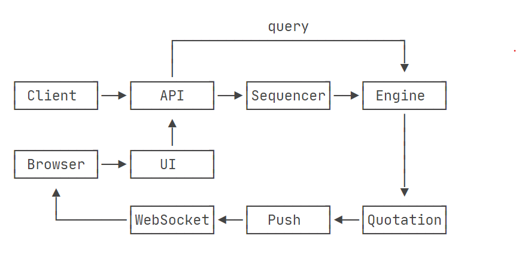
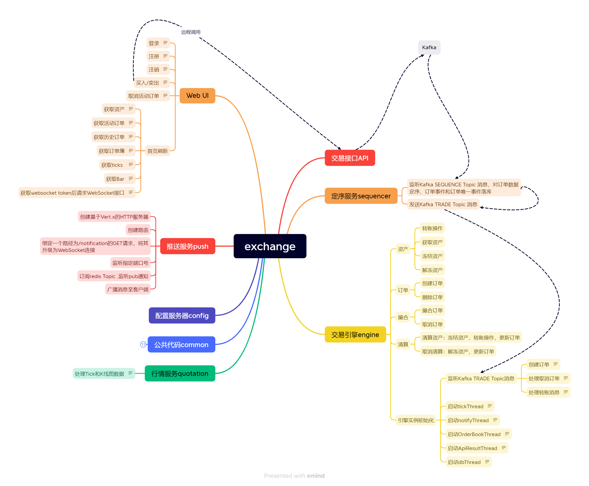

以Spring Cloud为基础，从零开始搭建一个简易的7x24小时运行的证券交易所。 

### 模块划分
整个系统从逻辑上可以划分为如下模块： 
1. API模块（Trading API），交易员下单、撤单的API入口； 
2. 定序模块（Sequencer），用于对所有收到的订单进行定序； 
3. 交易引擎（Trading Engine），对定序后的订单进行撮合、清算； 
4. 行情模块（Quotation），将撮合输出的成交信息汇总，形成K线图； 
5. 推送模块（Push），将市场行情、交易结果、资产变化等信息以WebSocket等途径推送给用户； 
6. UI模块（UI），给交易员提供一个Web操作界面，并把交易员的操作转发给后端API。

#### 模块关系图如下： 

### 交易引擎模块
交易引擎作为核心模块，内部划分为： 
1. 资产模块Asset 
2. 订单模块Order 
3. 撮合模块Match 
4. 清算模块Clearing 

引擎内部模块关系如下： 
 

### 项目代码模块
代码模块简要说明： 
- common：公共代码； 
- config：配置服务器； 
- push：推送服务； 
- quotation：行情服务； 
- trading-api：交易API服务； 
- trading-engine：交易引擎； 
- trading-sequencer：定序服务； 
- ui：用户Web界面。 
 

### 启动服务
1. 终端进入build文件夹，运行`docker-compose up -d` 启动mysql、Kafka、redis、zookeeper
2. 本地开发环境先config，再启动其他
3. docker环境，在项目根目录打开终端运行`docker-compose up -d`启动服务