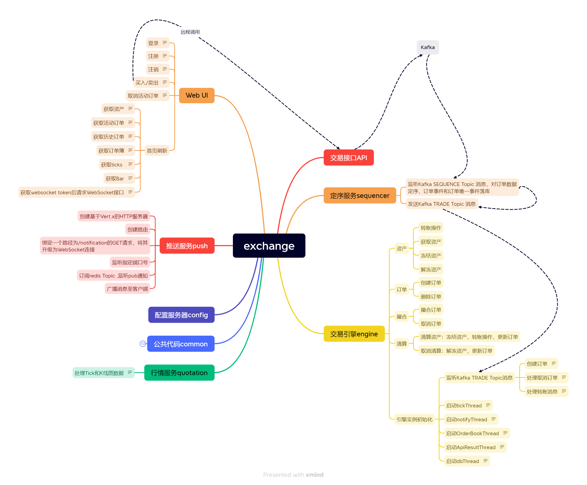

以Spring Cloud为基础，从零开始搭建一个简易的7x24小时运行的证券交易所。 

整个系统从逻辑上可以划分为如下模块： 
API模块（Trading API），交易员下单、撤单的API入口； 
定序模块（Sequencer），用于对所有收到的订单进行定序； 
交易引擎（Trading Engine），对定序后的订单进行撮合、清算； 
行情模块（Quotation），将撮合输出的成交信息汇总，形成K线图； 
推送模块（Push），将市场行情、交易结果、资产变化等信息以WebSocket等途径推送给用户； 
UI模块（UI），给交易员提供一个Web操作界面，并把交易员的操作转发给后端API。 
 

